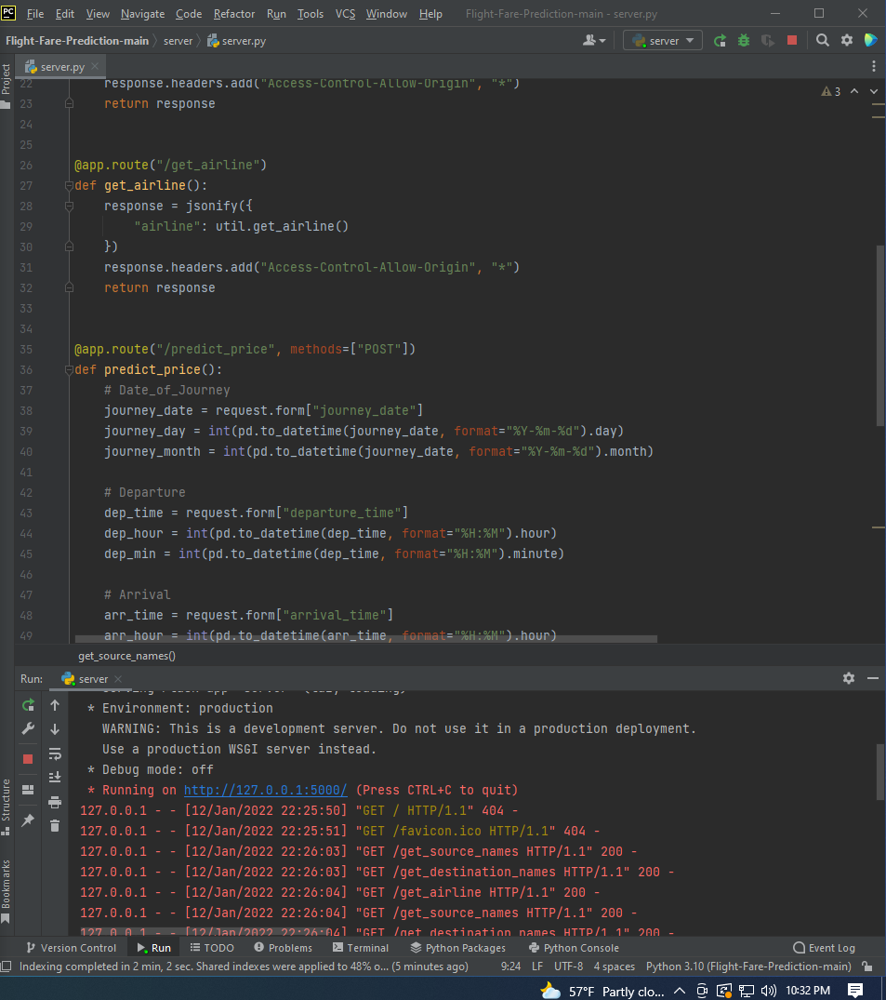

# Flight-Fare-Prediction

This is basicallty a Machine Learning Model for predictin the fare of flight. I have used RandomForestRegressor algorithm to predict the flight price.

## Machine Learning Model Creating Process:
1) Collecting the data source:
   For this I have downloaded the dataset from machine learning dataset repository i.e. Kaggle.
2) Data Preparation
   I tried to get the insights form dataset using various methodologies like manipulating the dataset, deleting the columns with NA values, tried Data Visualization, Feature Engineering, etc.
3) Model Selection
   I have made use of RandomForestRegressor for the model building. I have used RandomForestRegressor to improve the predictive accuracy and control over-fitting.
4) Training the Model
   I have splited the dataset to the ratio of 7:3 where 70% of the data is used for training purpose and 30% of the entire data is used to testing purpose.
5) Model Evaluation
   According to this I have evaluated the model using various methods like calculating the accuracy, root mean square etc.
6) Fine Tuning the Model
   I have used RandomizedSearchCV for hyperparameter tuning. This is done to find the best parameters that results in best accuracy of the model.
7) Prediction on Unseen Data
   After done with the seen data its time to get hands on on some unseen data to see the model performance.
   
## Next Steps:
I created the flask server to test deploy the model into real life project. For this I have written the code in python Flask.

